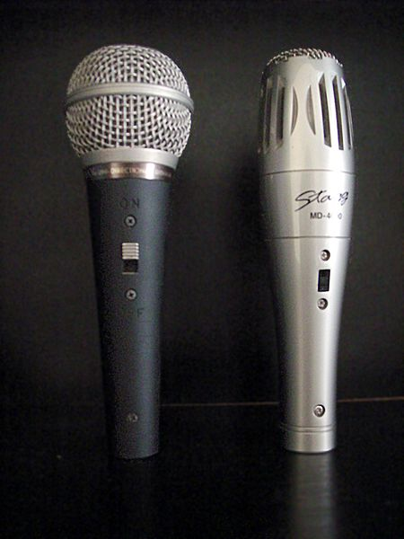
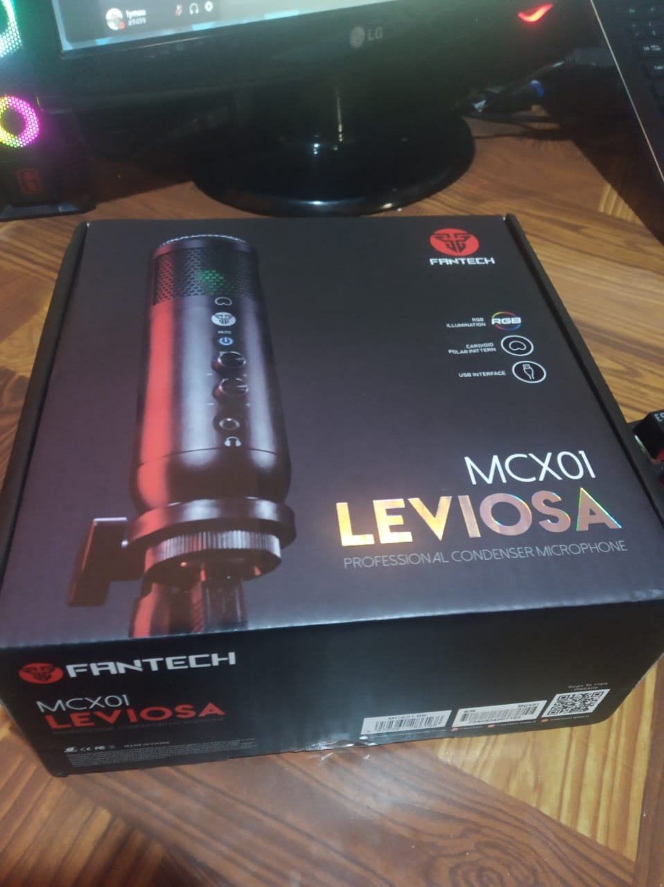
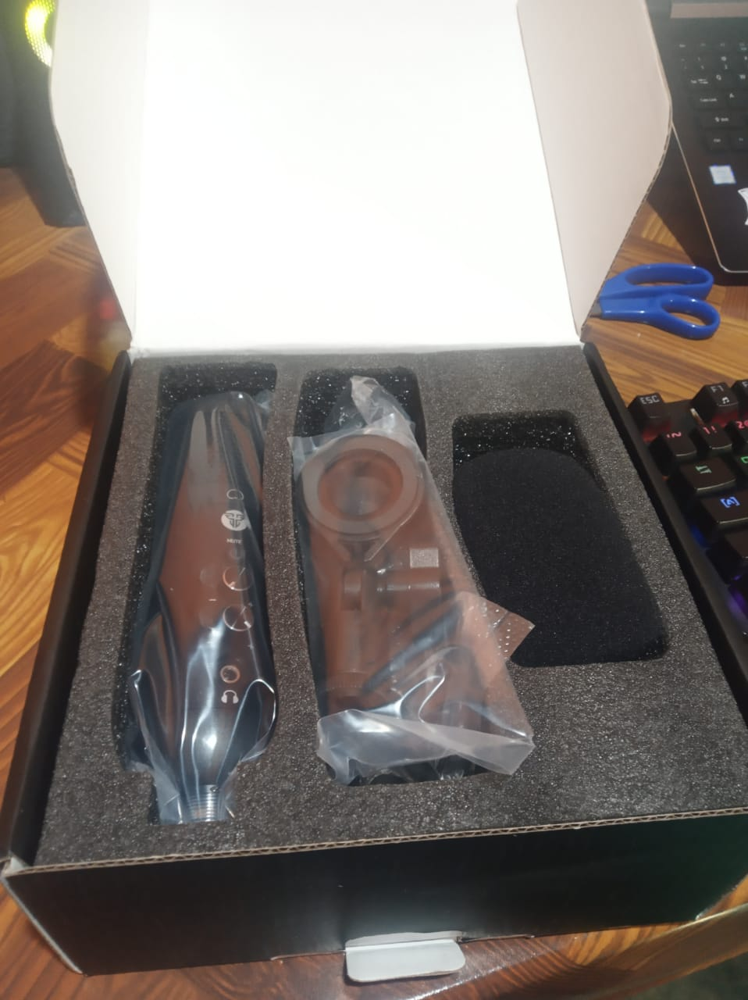
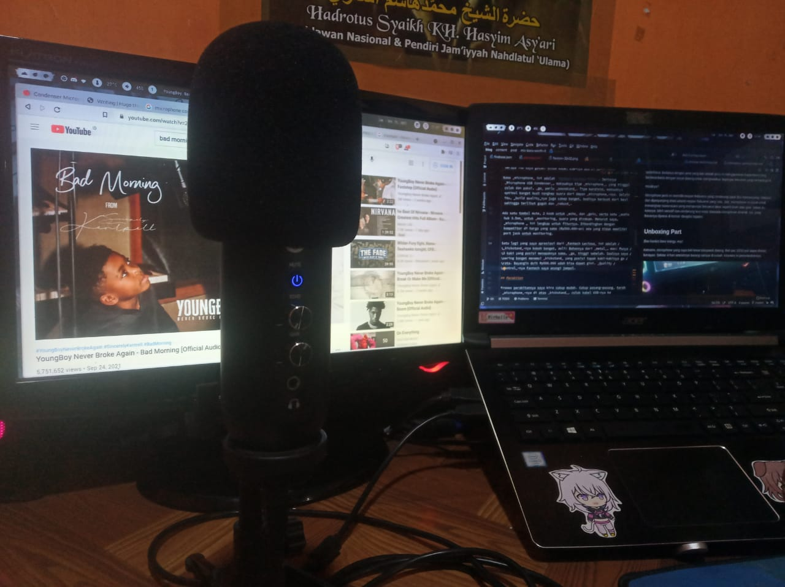
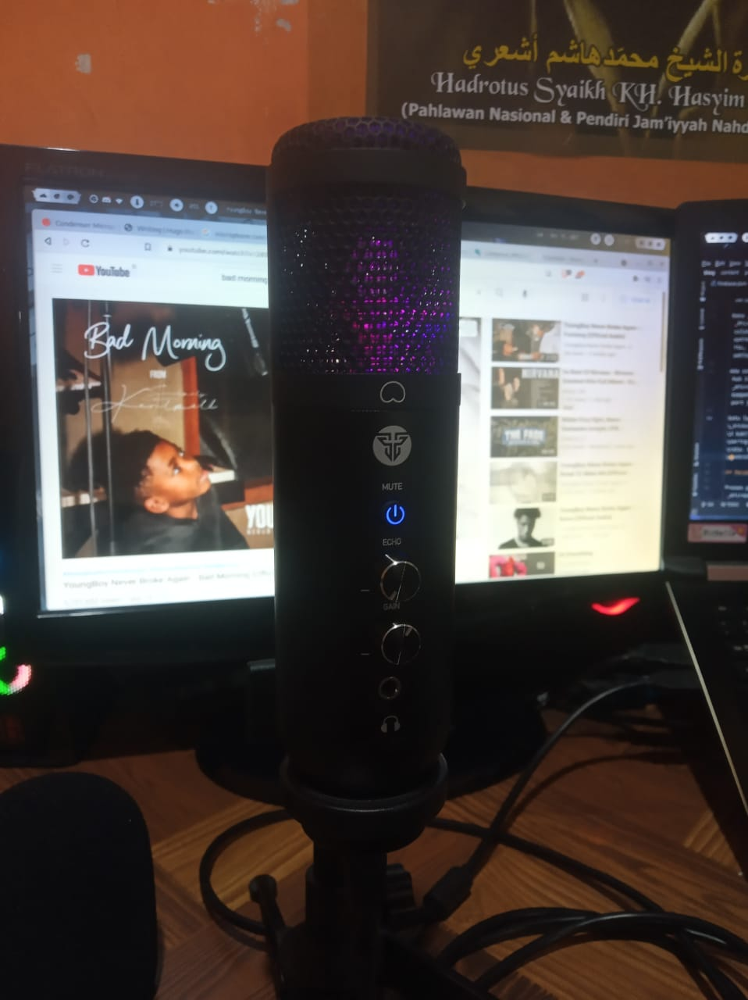
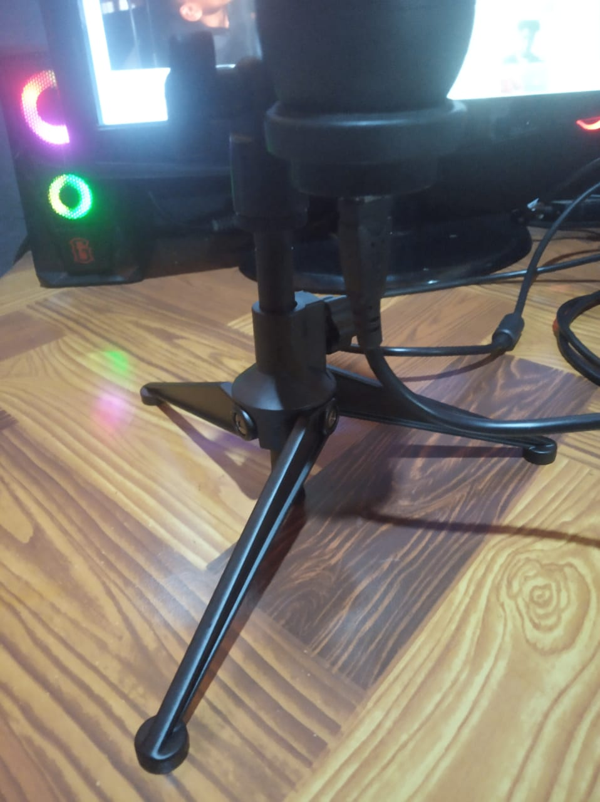

Ini kali pertama, saya membeli sebuah microphone bertipe USB condenser. _Okay, so what's condenser microphone?_
<!--more-->

Sebelum membahas lebih lanjut tentang mic yang saya beli ini, saya akan sedikit mengenalkan tentang _microphone_.

Sering kali kita mengasosiasikan _microphone_ dengan sesuatu yang berbentuk seperti seperti gambar di atas. Padahal, sebenernya yang dimaksud dengan _microphone_ adalah alat untuk menangkap suara. Seperti microphone di _smartphone_, acara dangdutan, _headset_, _headphone_. Benda-benda tersebut memiliki kesamaan yaitu terdapat _microphone_ di dalamnya.

Jadi, apa sebenarnya _microphone_ itu?

## _What's microphone?_  

Mikrofon (bahasa Inggris: _microphone_) adalah suatu jenis transduser yang mengubah energi-energi akustik (gelombang suara) menjadi sinyal listrik. Mikrofon merupakan salah satu alat untuk membantu komunikasi manusia. Mikrofon dipakai pada banyak alat seperti telepon, alat perekam, alat bantu dengar, dan pengudaraan radio serta televisi. [[Wikipedia]](https://id.wikipedia.org/wiki/Mikrofon)  

Jelas ya? _Pokoknya_, alat apapun yang mampu menangkap suara dan suara itu bisa diolah kembali, itu disebut sebagai _microphone_.

## Microphone Condenser

Nah, jenis _microphone_ ada bermacam-macam. Seperti yang saya sebutkan tadi, ada yang berbentuk tabung yang memanjang, dan ada pula yang tertanam di _smartphone_. Masing-masing punya tujuan yang berbeda-beda meskipun pada intinya adalah untuk menangkap suara.

_Microphone_ yang baru saja saya beli berjenis _condenser_ atau _capacitor microphone_. Secara sederhana, bedanya dengan jenis yang lain adalah jenis ini menggunakan _kapasitansi_ yang berbeda-beda dengan sinyal datang untuk menghasilkan tegangan keluaran yang berbeda pula.  

Hasilnya?

_Microphone_ jenis ini memiliki respon frekuensi yang cenderung datar dan diperpanjang. Maksud dari diperpanjang disini adalah respon frekuensi yang luas. Jadi, _microphone_ ini cocok untuk menangkap suara-suara yang mempunyai frekuensi lebar seperti drum atau gitar. Selain itu, _katanya_, lebih sensitif dan cenderung _less noisy_ daripada _microphone_ dinamik. Iya, itu yang biasanya dipakai di konser dangdut hajatan.

## Unboxing Part

_Bau kardus baru wangy, euy!_

Kemarin, _microphone_ yang saya beli lewat tokopaedi dateng. Beli pas 10/10 jadi dapet diskon, lumayan. Harga awal sekitar Rp500.000-an, dan ketika saya beli harganya Rp462.000. Sekitar 4 hari setelahnya barang sampai di rumah. Kira-kira ini penampakannya.

Ukurannya _box_-nya cukup besar, _kalo_ dikira-kira sih panjang dan lebar sama-sama satu jengkal, sedangkan untuk tingginya sekitar 8-10cm. Bahan yang dipakai juga berasal dari karton yang cukup tebal, jadi benda yang di dalam aman. Oh ya, sebelum _bubble wrap_-nya saya buka, dia cuma ada 1 lapis _doang_, untung tertolong sama karton-nya yang _rigid_. Gambar _microphonenya_ juga _glossy_ ya, jadi keren aja gitu ,menurut saya. Buat perancang _packaging_-nya salut deh!  

Itu adalah foto setelah _box_ nya dibuka. Di dalamnya ada _mic_-nya itu sendiri, _kickstand_, busa _mic_, dan kabel USB. Oh ya, yang pasti selalu ada di setiap _box_ produk elektronik adalah _manual_. Tiap komponennya dibungkus plastik yang cukup tebal, tapi jenis plastik PE berapa itu saya gatau. Untuk kabel USB-nya ada di bawah busa.  

Nama _microphone_ ini adalah `Fantech Leviosa MCX01`. Jenisnya _Microphone USB Condenser_, maksudnya tipe _microphone_, yang tinggal colok dan pakai, _ga_ perlu _soundcard_. Tipe kardioid, maksudnya optimal banget buat nangkep suara dari depan _microphone_-nya. Selain itu, _build quality_-nya juga cakep banget, bodinya terbuat dari besi sehingga terlihat gagah dan _robust_.  

Ada satu tombol mute, 2 knob untuk _echo_ dan _gain_ serta satu _audio hub 3.5mm_ untuk _monitoring_ suara yang direkam. Menurut saya, _microphone_ ini lengkap untuk fiturnya. Dibandingkan dengan kompetitor di harga yang sama (Rp500.000-an) ada yang tidak memiliki port jack untuk monitoring.  

_Ambient dari RGB light-nya aneh banget cuy! Nanggung, luminositasnya ga kuat ya ga lemah. Jadi, terlihat aneh._

Satu lagi yang saya apresiasi dari _Fantech Leviosa_ ini adalah _kickstand_-nya kokoh banget, asli! Bahannya dari _metal_, man! Punya 3 kaki yang posisi menapaknya sama, _ga_ tinggi sebelah. Soalnya saya sering banget menemui _kickstand_ yang posisi tapak kaki-kakinya ga rata. Bayangin duit Rp500.000 udah bisa dapet gini. _Quality control_-nya Fantech saya acungi jempol.  

## Perakitan

Proses perakitannya saya kira cukup mudah. Cukup pasang-pasang, taroh _microphone_-nya di atas _kickstand_, colok kabel USB-nya ke _microphone_ dan laptop. _That's it!_ Udah gitu doang. Simple. Lanjut aja ke _sound test deh_ ya.  

## _Sound Test_

### OBS Studio
Saya menggunakan OBS Studio versi 27.0.1-3 di atas mesin EndeavourOS (LINUX) sebagai _tool_ untuk merekam. Alasan saya menggunakan OBS Studio adalah karena _open-source_, dukungan komunitas yang luas, dan untuk kedepannya saya akan menggunakan OBS Studio untuk membuat video.  

### Lingkungan 
Saya merekam di ruang yang tidak sepenuhnya tertutup dinding dari batu bata, terhubung dengan koridor yang menghubungkan ruang tamu dan ruang makan. _To the point, noisy!_ Posisi mulut dengan _microphone_ berjarak sekitar satu jengkal. Saya akan menunjukkan beberapa perbandingan dari beberapa kondisi yang mungkin sehingga teman-teman bisa melihat bagaimana kemampuan Fantech Leviosa MCX01 ini.

### Testing

#### Mic Only  
Direkam hanya dengan menggunakan _microphone_. Posisi gain menunjuk ke arah jam 1, echo 0.  _This is how it sounds!_



_Kalo menurut temen-temen, suara kipas angin kedengeran ga? Jaraknya sekitar 1 meter dari mic-nya._

#### Filter (Noise Suppression, Limiter, Gain, Expander, Compressor)



Jika dibandingkan dengan yang sebelumnya (tanpa filter), suara yang dihasilkan terlihat lebih jernih dan cukup powerful.

#### Previous Filter + Background Noise



Suara keyboard masih terdengar jelas. Jarak keyboard dari _microphone_ emang deket banget sih, cuma 1 jengkal.

#### On the Right Side of Microphone



_Yes,_ suaranya tidak terlalu oke. Tipe kardioid optimal menangkap suara dari depan. Jadi, kalo dari belakang maupun samping kurang bisa menangkap dengan baik.

#### Previous Filter + Echo (Pointing at 10.00 o'clock)



Fitur buat nyanyi. Tidak terlalu penting sih tapi ya mungkin bisa dicoba kali ya nyanyi.

## Kesimpulan

Menurut saya, _microphone_ ini udah lebih dari cukup untuk kebutuhan saya, yaitu untuk _meeting_, _voice recording_, dan ~~~nyanyi~~~. Diharga Rp500.000 ini udah oke banget. Untuk temen-temen yang nyari _microphone_ yang gak ribet tinggal colok dan pakai, murah, podcast edgy nan kekinian ini jawabannya. 

Pastikan juga untuk mengolah file hasil rekamannya agar lebih baik lagi. Suara mentah, masih nangkap _low frequency noise._ Wajib banget pasang filter _noise gate_ atau _noise suppression_

Salam dari Lymau. Jeruk Limau.

